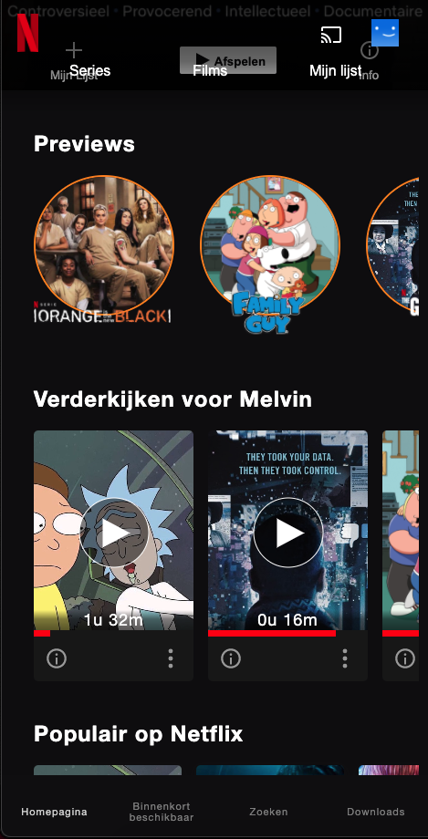

# Procesverslag
**Auteur:** Melvin Idema

## Bronnenlijst
#### Netflix voor overige content & ontwerp
https://netflix.com
#### TheGreatHackFrame
https://www.trouw.nl/nieuws/the-great-hack-laat-zien-hoe-cambridge-analytica-en-andere-bedrijven-ons-manipuleren~bf9f8d3f/
#### Download Icon
https://www.visualpharm.com/free-icons/download-595b40b85ba036ed117dc091
#### Paper Airplane Icon
https://www.flaticon.com/free-icon/send_2983788
#### Hide Scrollbar Code
https://www.w3schools.com/howto/howto_css_hide_scrollbars.asp
## Eindgesprek (Week 7/8)
De code was goed, CSS variablen gebruikt. Exotische CSS-selectoren. Alleen geen Javascript, weinig responsive, de structuur van het project een zooitje. Had ik geen 2 pagina's. Mistte ik bronnen en heb ik de screenreader test nog niet gedaan. En ik mistte een micro-interactie. 

## Toegankelijkheidstest

Doordat Netflix eigenlijk voornamelijk visueel is en heel veel visuele content bevat is toegankelijkheid met een screenreader heel tricky. Je moet veel gebruik maken van alt attributes. De "normale" benadering van front-end programmeren waarbij je voor complexere ontwerpen CSS backgrounds gebruikt is eigenlijk niet bruikbaar voor een betere toegankelijkheid met zo'n visuele content. 

Via tab is de hele website te bereiken, ook heb ik extra gebruik gemaakt van de tabindex attribute.

## Voortgang (Week 6)
Alles was in deze week duidelijk, eigenlijk geen vragen. Alleen hoe je het best content van Netflix af kon halen. Uiteindelijk uitgekomen op movieposterAPI.

## Voortgang (Week 5)
Een 100% height meegeven aan plaatjes of SVGtjes werkt niet als ze zich bevinden in flex-items. Op de een of andere manier lukte het me maar niet om deze responsive te krijgen. Heel vervelend. Uiteindelijk blijkt dat de container waarin hij de relatieve 100% afhaalt opbubbelt. Dus bij een section > ul > li > figure > svg gaat hij eerst naar de figure, dan li, dan ul en dan section om te kijken wat de maximale hoogte kan zijn. Je dient dus voor al die ouders een max hoogte in te stellen. 

## Voortgang (Week 3)

### Stand van zaken
Op dit moment was mijn project nog zo klein dat ik geen vragen had. Wel was het leerzaam om de vragen van m'n medestudenten aan te horen. 

### Agenda voor meeting

-samen met je groepje opstellen-

| Luke                                    | Melvin    | Sam                 | Jimmy               |
| ---                                     | ---       | ---                 | ---                 |
| Margin: 0; werkt niet                   | n.v.t.    | Tips over de nav.   | blur nav            |
| Elementen na relative en absolute       |           |                     | Viewport animaties? |
| Font via telefoon anders dan op desktop |           |                     |                     |

### Verslag van meeting

-na afloop snel uitkomsten vastleggen-

## Breakdownschets (week 1)

**Gehele Breakdownschets:**

**Details Breakdownschets:**

## Intake (week 1)
**Je startniveau:** De Zwarte Piste

**Je focus:** Surface Laag

**Je opdracht:** https://www.netflix.com/

**Screenshot(s) van de eerste pagina (small screen):**

**Screenshot(s) van de tweede pagina (small screen):**

